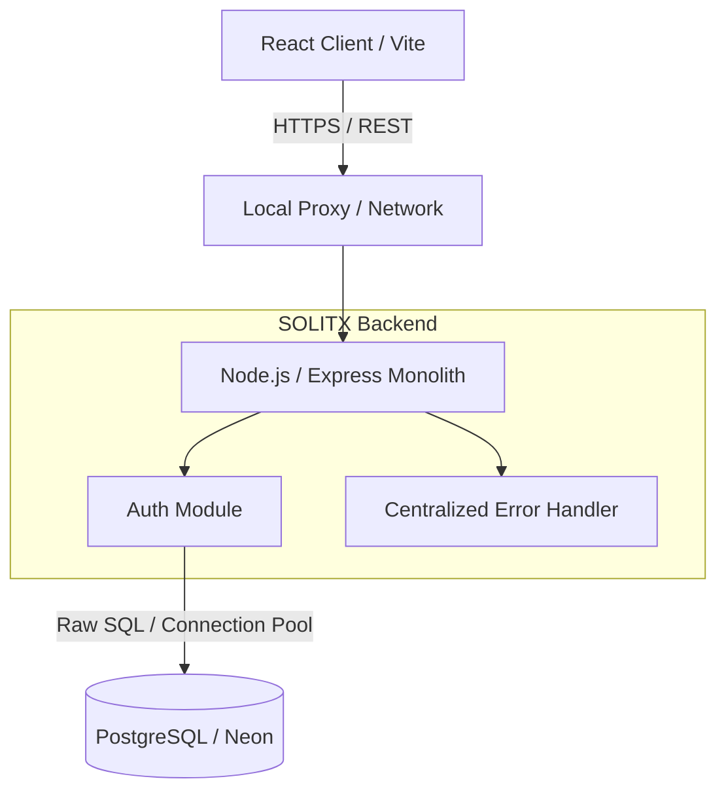

# Architecture V1 - The Foundation

## Current State (Day 3)

The initial system architecture is designed as a strict monolith, prioritizing simplicity, strong consistency, and minimal operational overhead.

## Justification
At this stage, we have 0 active users and no concurrent load. Introducing microservices, caching layers (Redis), or message brokers (Kafka) would be premature optimization. We rely entirely on PostgreSQL for data integrity and state.

## Bottlenecks
As traffic scales, the Node.js single thread may become CPU bound during heavy password hashing (`bcrypt`), and the database connection pool may exhaust under high concurrent requests.
